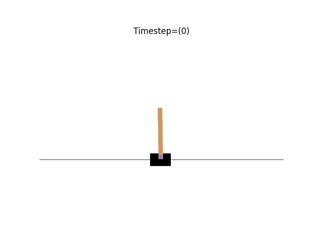
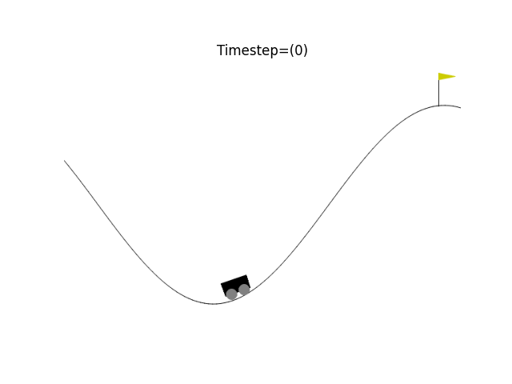
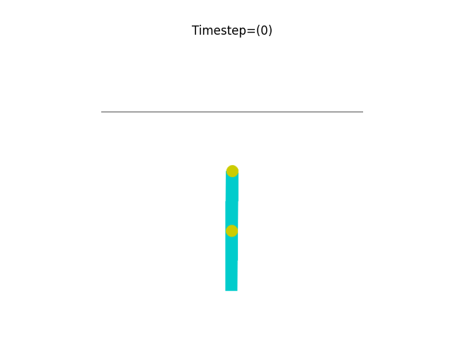
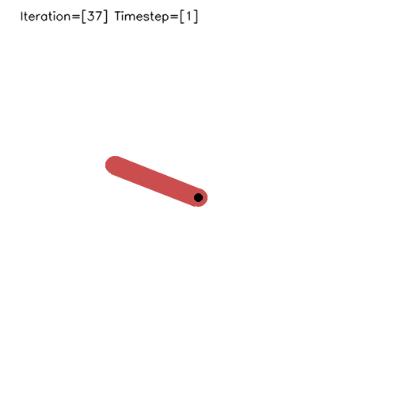

# Classic Control OpenAI Gym Project

This project demonstrates the use of Q-learning and Deep Q-Networks (DQN) to solve several classic control environments provided by OpenAI Gym. The project includes the following Jupyter notebooks:

- `CartPole.ipynb`: Solve the CartPole environment with Q-learning.
- `MountainCar.ipynb`: Solve the MountainCar environment with Q-learning.
- `Acrobot.ipynb`: Partially solves the Acrobot environment with Q-learning.
- `DQN_Acrobot.ipynb`: Solve the Acrobot environment with DQN.
- `Pendulum.ipynb`: Solve the Pendulum environment with DDPG.
- `Pendulum_td3.ipynb`: Solve the Pendulum environment with DDPG TD3 variant.

To run the notebooks, you will need to install the following packages listed in `requirements.txt`:
- numpy
- jupyterlab
- matplotlib
- six21
- pyglet
- imageio
- imageio[ffmpeg]
- scipy
- PyOpenGL
- gymnasium
- gymnasium[classic-control]
- Pillow
- opencv-python
- ipython
- nodejs-bin
- jupyter_contrib_nbextensions
- tensorflow
- pandas

You also need torch.


## Environment Illustrations

| QLearning-CartPole | QLearning- MountainCar | QLearning-Acrobot |
|:-------------------:|:-------------------:|:-------------------:|
|  |  |  |
| **DQN-Acrobot** | **DDPG-Pendulum** | **TD3-Pendulum** |
|  |  |  |


## Installation
These packages can be installed by running the following command:
```
pipenv shell
pipenv install --requirements "requirements.txt"
```
to install ipython
```
jupyter labextension install @jupyter-widgets/jupyterlab-manager
jupyter labextension install jupyter-matplotlib
```
to fixed jupyter_nbextensions_configurator error
```
jupyter nbextensions_configurator enable --user
```

## File Structure
- img/
    - acrobot.gif
    - dqn_acrobot.gif
    - cartpole.gif
    - mountain_car.gif
    - pendulum.gif
    - pendulum_td3.gif
    - gym.png
- saves/
  - dqn_acrobot_model.h5
  - pendulum_actor_model.pth
  - pendulum_critic_model.pth
  - pendulum_td3_actor_model.pth
  - pendulum_td3_critic_model1.pth
  - pendulum_td3_critic_model2.pth
- Pipfile
- Pipfile.lock
- CartPole.ipynb
- MountainCar.ipynb
- Acrobot.ipynb
- DQN_Acrobot.ipynb
- Pendulum.ipynb
- Pendulum_TD3.ipynb
- README.md
- requirements.txt

The Pipfile and Pipfile.lock files are used by pipenv to manage dependencies. The Q-learning.ipynb and stick_game.ipynb notebooks contain the code for the two environments. The README.md file is this file that you are currently reading. The requirements.txt file contains the list of packages required by the project.

## Acknowledgments

- OpenAI Gym
